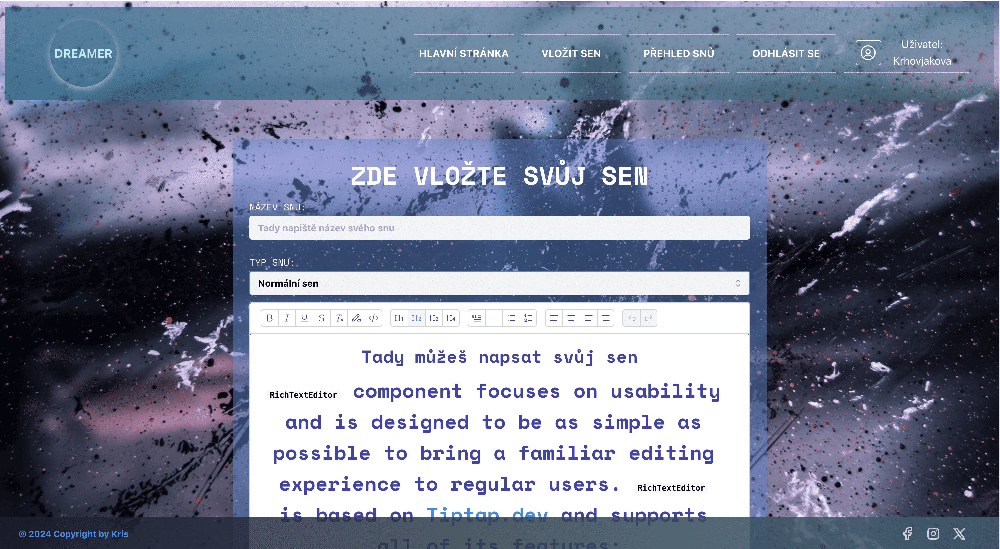

# Dream Editing Journalist - Personal Web Development Project

This project showcases my web development skills through "Dream Editing Journalist" website.  It's designed to demonstrate my proficiency in [JavaScript, React, Node.js, HTML, CSS, RWD, Vite and Supabase]. 

## Description

This website simulates the online presence of a journalist specializing in dream interpretation and analysis.  It features Dream journaling by type, including an overview of all dreams, a portfolio section, user authentication.  The design aims for a clean, professional and artistic look that's both visually appealing and easy to navigate.

## Technologies Used

* Frontend: [ Vite.js, React, Typescript, JavaScript, HTML5, CSS,  
  Responsive Web Design (RWD) using CSS media queries ]
* Backend: [ Node.js, Json, Supabase ]
* Other: [ Netlify, UI Mantine ]

## Challenges and Solutions

This React application utilizes the Mantine UI library for its visual components.  Development involved overcoming hurdle: adapting existing TypeScript code into a React context (despite lacking prior TypeScript knowledge).

## Future Improvements

For future iterations, I plan to explore styling solutions like SASS, Bootstrap or Tailwind CSS, along with integrating AI functionalities. I'd like to add more features.

## Contact

https://www.linkedin.com/in/kristyna-krhovjakova-622892a2/

## Web
https://dream-edit.netlify.app/
Aplication is writen in Czech language

